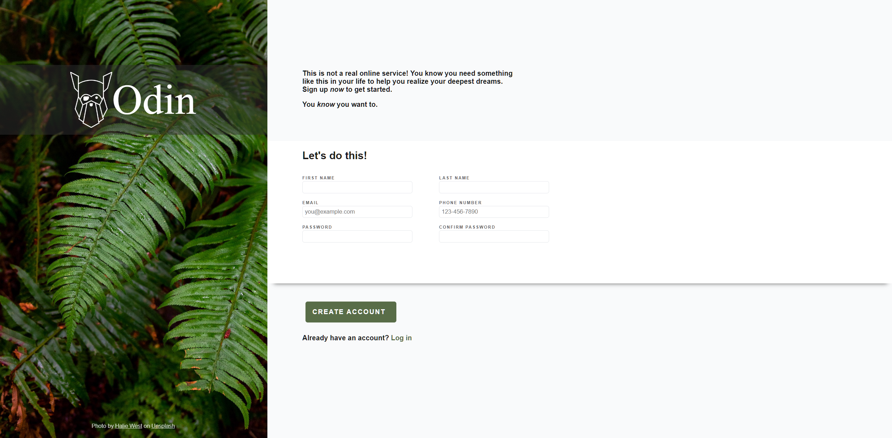

# sign-up-form
This is a sign-up form as part of The Odin Project. 
The purpose of this project was to gain experience working with input forms.

## Links
- [Live page here](https://jonathan-d-n.github.io/sign-up-form/)
- [Link to the assignment](https://www.theodinproject.com/lessons/node-path-intermediate-html-and-css-sign-up-form)

## Features
- Displays error messages for form validation

## About
This is an input form that checks for the following:
- First and last name (any value accepted)
- A valid Email address
- A 10 digit phone number
- A password and password confirmation, both of which must match